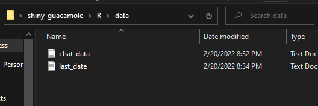
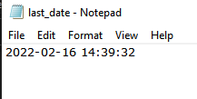

# URL Extractor for WhatsApp Chats

This repo contains codes developed in **R** and **Python** for extracting URLs sent in a Whatsapp Chat.

After cloning this repo, make sure to create a new folder called "**data**" in the R/Python folder to [store the exported WhatsApp chat data](https://faq.whatsapp.com/android/chats/how-to-save-your-chat-history/?lang=en "How to export whatsapp chats") (**chat_data**) and to also store the time the last chat was sent. (**last_date**).

### Checklist

1.   **data** folder created with **chat_data** and **last_date** (*.txt*) files created.
2.  Make sure to rename the WhatsApp data to **chat_data.**



Write a date to filter by in the last_date.txt file. If it is the first time you are running this, use a date that is before the earliest date. For example, if the earliest date in your chat history is **2020-04-12 09:34:21,** input a date earlier than that in the last_date.txt file.

The last_date.txt looks like this.



## Instructions for Python

After creating the data folder, run the url_extractor.py file.

```{python}
python url_extractor.py

```

## Instructions for R

After creating the data folder, open the `learning-targets` project file and run

```{r}
targets::tar_make()

```

Exported URLs are located at the `processed_links` folder for both R and Python.

## Deliverable

+----------------------+-----------------------------+----------------------------------------------------------------------------------------------------------------------------------------------------------------------------------------------------------------------------------------------------------------------------------------------------------------------------------+
| datetime             | author                      | url                                                                                                                                                                                                                                                                                                                              |
+:====================:+=============================+==================================================================================================================================================================================================================================================================================================================================+
| 2020-04-12T21:43:32Z | +234 \*\*\* \*\*\* \*\*\*\* | [<https://databricks.com/sparkaisummit/north-america-2020>](https://databricks.com/sparkaisummit/north-america-2020){.uri}                                                                                                                                                                                                       |
+----------------------+-----------------------------+----------------------------------------------------------------------------------------------------------------------------------------------------------------------------------------------------------------------------------------------------------------------------------------------------------------------------------+
| 2020-04-12T23:31:32Z | +234 \*\*\* \*\*\* \*\*\*\* | [<https://info.microsoft.com/CE-AzureINFRA-WBNR-FY20-04Apr-21-MicrosoftAzureVirtualTrainingDayFundamentalsMaster-SRDEM17525_LP01Registration-ForminBody.html>](https://info.microsoft.com/CE-AzureINFRA-WBNR-FY20-04Apr-21-MicrosoftAzureVirtualTrainingDayFundamentalsMaster-SRDEM17525_LP01Registration-ForminBody.html){.uri} |
+----------------------+-----------------------------+----------------------------------------------------------------------------------------------------------------------------------------------------------------------------------------------------------------------------------------------------------------------------------------------------------------------------------+
| 2020-04-13T15:39:32Z | +234 \*\*\* \*\*\* \*\*\*\* | [<https://www.myjobmag.com/jobs/microsoft-nigeria-software-engineering-internship-program?utm_source=email&utm_medium=email&utm_campaign=email>](https://www.myjobmag.com/jobs/microsoft-nigeria-software-engineering-internship-program?utm_source=email&utm_medium=email&utm_campaign=email){.uri}                             |
+----------------------+-----------------------------+----------------------------------------------------------------------------------------------------------------------------------------------------------------------------------------------------------------------------------------------------------------------------------------------------------------------------------+
